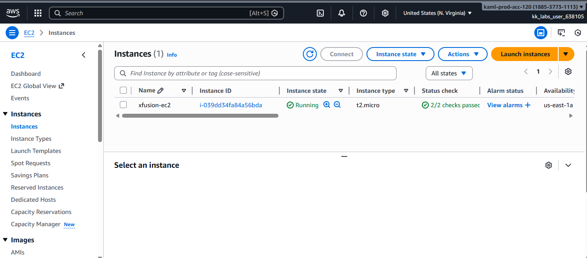
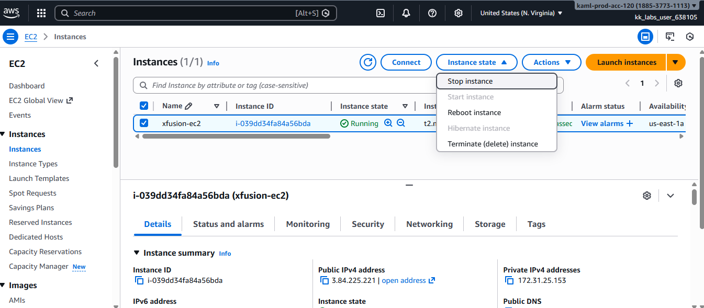
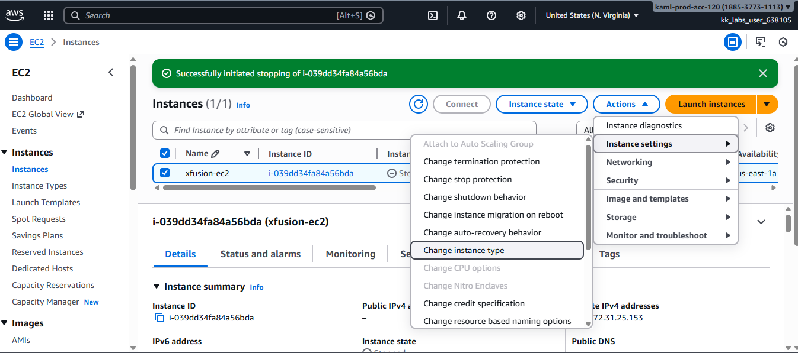
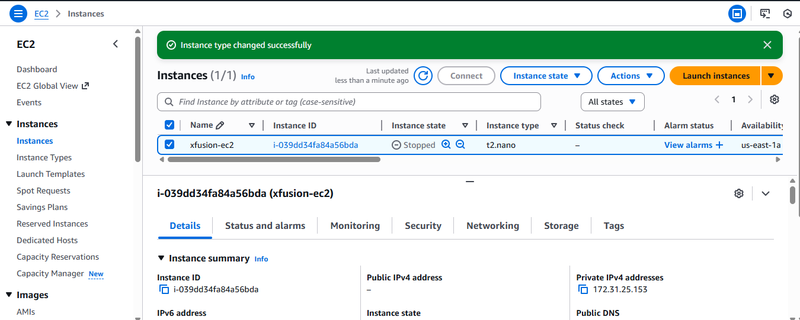
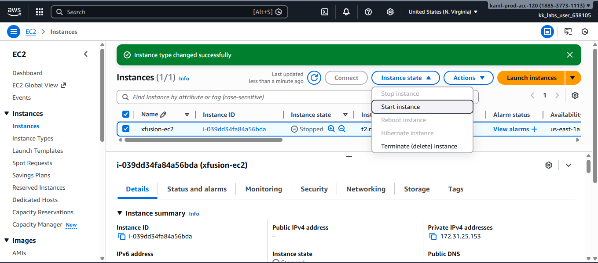
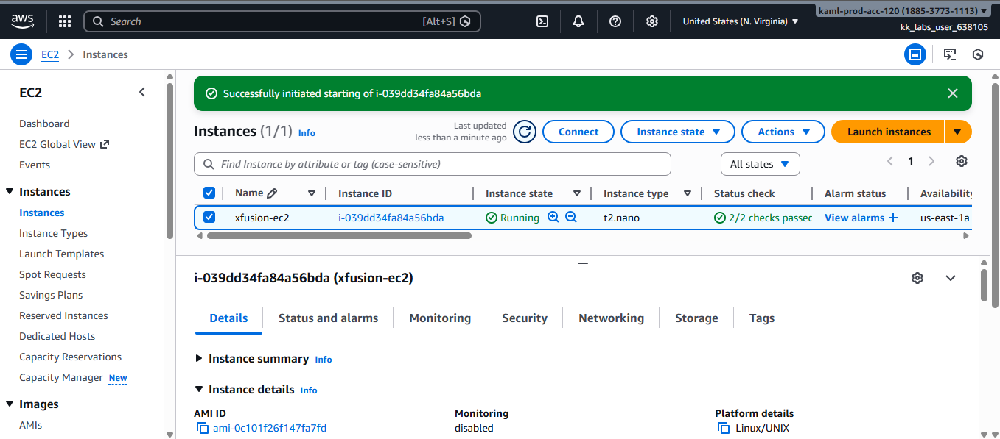

# Change-EC2-Instance-Type-for-Cost-Optimization

This guide documents how to change an AWS EC2 instance type from **t2.micro** to **t2.nano** to optimize resource utilization and cost.  
The task ensures that all **status checks are completed** before making changes and that the instance is **running successfully** afterward.

## Step 1: Log in to the AWS Management Console

Sign in to the AWS Management Console using your credentials.

## Step 2: Navigate to the EC2 Dashboard
- From the AWS services menu, select **EC2**
- Click **Instances** from the left navigation pane

## Step 3: Locate the EC2 Instance
- Search for the instance named **xfusion-ec2**
- Select the instance checkbox

## Step 4: Verify Instance Status Checks
Before making any changes, confirm that the instance has completed its status checks.
- Ensure **Status check = 2/2 checks passed**
- If the status shows **Initializing**, wait until checks are complete

## Step 5: Stop the EC2 Instance
Changing an instance type requires the instance to be stopped.
- Select the instance
- Click **Instance state**
- Choose **Stop instance**
- Confirm the action

Wait until the **Instance state** changes to **Stopped**.

## Step 6: Change the Instance Type
- Select the stopped instance
- Click **Actions**
- Navigate to **Instance settings**
- Click **Change instance type**

- Select **t2.nano**
- Click **Apply**

## Step 7: Start the EC2 Instance
- Select the instance
- Click **Instance state**
- Choose **Start instance**

## Step 8: Final Verification
Confirm the following:
- Instance name: **xfusion-ec2**
- Instance type: **t2.nano**
- Instance state: **Running**
- Status checks: **2/2 checks passed**

## Conclusion

- Changing the EC2 instance type is an effective way to optimize cost for underutilized resources.
- Always ensure status checks are completed before making configuration changes.
- Downsizing instances like this supports AWS cost optimization best practices and efficient cloud resource management.
 
